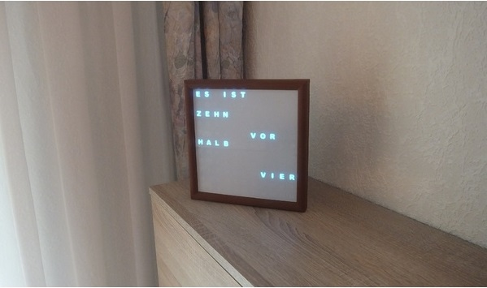
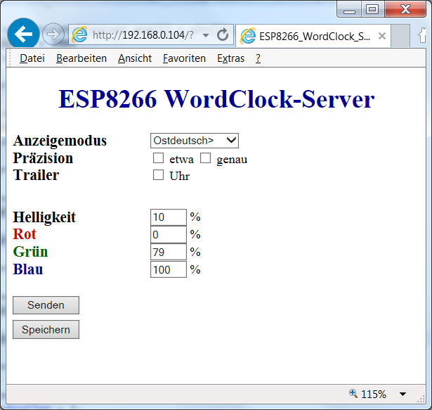

# WordClock ESP8266

Eine Uhr mit Textanzeige der Uhrzeit basierend auf einem [ESP8266 NodeMCU](https://www.aliexpress.com/item/1PCS-ESP8266-NodeMCU-V3-Lua-WIFI-module-memory-32M-Flash-USB-serial-CH340G/32820380705.html) mit adressierbaren RGB-LED-Stripes und 3D-druckbaren Gehäuseteilen
Die 3D-Modelle für das Gehäuse sind auf thingiverse.com [Uhren-Gehäuse](http://www.thingiverse.com/thing:2137765) und [ESP8266-Gehäuse](https://www.thingiverse.com/thing:2842012) verfügbar.

Die Software ist eine Quick'n Dirty-Adaption meiner für den [RaspberryPi](https://github.com/xSnowHeadx/word-clock) geschriebenen Software natürlich ohne Audio-Funktionen. Sie wird (wenn mal Zeit ist) besser strukturiert und der Web-Server überarbeitet.

## Hardware Setup

Für den Aufbau der Word-Clock werden folgende Komponenten benötigt:

- [ESP8266 NodeMCU](https://www.aliexpress.com/item/1PCS-ESP8266-NodeMCU-V3-Lua-WIFI-module-memory-32M-Flash-USB-serial-CH340G/32820380705.html)
- [WS2811 RGB LED Strip](http://www.ebay.de/itm/WS2812B-LED-Stripe-4m-RGB-60-LEDs-m-Klebestreifen-WS2811-WS2812-/251901768682?pt=LH_DefaultDomain_77&hash=item3aa683f3ea): Die Gehäuseteile sind für die Verwendung dieser LED ausgelegt. Bei bestimmten LED-Typen benötigt man einen Pegelwandler von den 3,3V des ESP8266 auf die 5V der LED. 
- optional [ESP8266-Gehäuse](https://www.thingiverse.com/thing:2842012)
- 1 [5V-Netzteil](http://www.amazon.de/gp/product/B004S7U4IO)
- diverse Kabel, Lötwerkzeug
- die 3D-gedruckten Gehäuseteile

# Hardwareaufbau:

Die Verbindung vom ESP8266 zum LED-Stripe kann wie [hier](https://github.com/lvidarte/esp8266/wiki/MicroPython:-NeoPixels) beschrieben erfolgen. Wie abgebildet, kann auch "D5" (Pin 14) als Datenpin verwendet werden. Über die Änderung der Definition für "DATA_PIN" in Zeile 42 der "ino"-Datei kann dieser Pin auf Wunsch auch geändert werden.

Die Spannungsversorgung sollte allerdings nicht vom USB-Port aus, sondern durch ein zusätzliches 5V-Netzteil erfolgen.  

# Software

Das Projekt besteht nur aus einer einzigen "ino"-Datei, welche nach Einbindung der erforderlichen Bibliotheken mit jeder Arduino-tauglichen Entwicklungsumgebung gebaut und geflasht werden kann.

##### Standard libraries
* DNSServer
* Wire
* SPI
* EEPROM
##### Special libraries
* from [ESP8266-core](https://github.com/esp8266/Arduino)
	* ESP8266
	* ESP8266WebServer
	* ESP8266WiFi
* [NTPClient](https://github.com/arduino-libraries/NTPClient)
* [WiFiManager](https://github.com/tzapu/WiFiManager)
* [Time](https://github.com/PaulStoffregen/Time)
* [Timezone](https://github.com/JChristensen/Timezone)
* [FastLED](https://github.com/FastLED/FastLED)

## Web-Interface

Damit auf den ESP8266 zugegriffen werden kann, muß sich dieser im WLAN anmelden können. Das erledigt der WiFi-Manager, dessen Konfiguration auf [dessen Seite](https://github.com/tzapu/WiFiManager#how-it-works) beschrieben ist.

Die Steuerung von WordClock_ESP8266 über Webinterface funktioniert von jedem beliebigen Gerät mit Web-Client (Browser, wget, curl o.Ä.) aus. Hier eine Beschreibung der Befehle und Parameter für das Webinterface (statt "clockip" die IP des des ESP8266 (auslesbar am Router oder über die serielle Konsole) und statt "color" die gewünschten Farben "RED", "GREEN" oder "BLUE" verwenden. "n" wird durch die gewünschten Ziffern ersetzt. "on" schaltet eine Option ein, "off" schaltet sie aus.
Wird hinter dem "=" kein Parameter angegeben, wird statt der aktualisierten Website der Wert des entsprechenden Parameters als Plaintext mit Zeilenumbruch am Ende zurückgegeben. Also "http://clockip/?BRIGHT=" liefert z.B. "BRIGHT=100". Diese Antwort kann dann mit Scripten ausgwertet werden, über welche auch eine Steuerung der Uhr erfolgen kann.

*Modus setzen:*  
`http://clockip?MODE=n`

"n" = 0 bedeutet ostdeutsches Anzeigeformat (zehn vor halb Vier), "n" = 1 westdeutsches Anzeigeformat (zwanzig nach Drei), "n" = 2 startet das diagonale Moodlight, "n" = 3 das flächige Moodlight

*Anzeige von "etwa" steuern:*  
`http://clockip?PREC_ETWA=on`

Bei "on" wird bei größeren 5-Minuten-Rundungsabweichungen "etwa" mit angezeigt, bei "off" nicht
 
*Anzeige von "genau" steuern:*  
`http://clockip?PREC_GENAU=on`

Bei "on" wird bei exakter Minutenübereinstimmung "genau" mit angezeigt, bei "off" nicht
 
*Anzeige von "Uhr" am Ende steuern:*  
`http://clockip?TRAILER=on`

Bei "on" wird am Ende der Textanzeige "Uhr" mit angezeigt, bei "off" nicht
 
*Gesamthelligkeit setzen (0...100%):*  
`http://clockip?BRIGHT=nnn`

*Intensität einer Farbe setzen (0...100%):*  
`http://clockip?color=nnn`

Nicht vergessen: statt "color" die Farben "RED", "GREEN" oder "BLUE" einsetzen.

*Einstellungen speichern*  
`http://clockip?SAVE=`

Die vorher getätigten Einstellungen werden im EEPROM abgespeichert und beim nächsten Einschalten wieder verwendet.

Da ein Web-Server ingtegriert ist, kann die Einstellung der Parameter auch einfach über einen Browser erfolgen. Die Einstellungsseite sieht dann so aus:

Die zu sehenden Parameter entsprechen den weiter oben erläuterten. Die getätigten Einstellungen werden erst mit dem Button "Senden" gesammelt an die Uhr übertragen, und mit "Speichern" dort auch für den nächsten Start gespeichert.